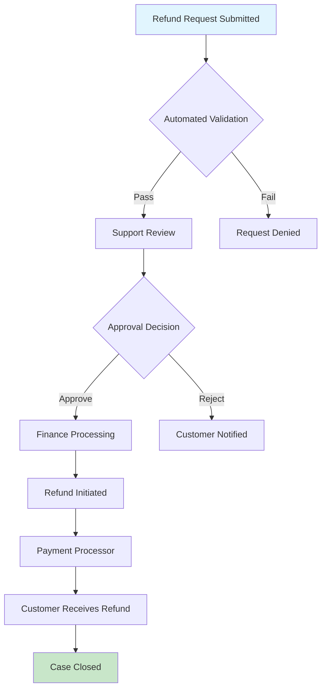

# PRDForge Refund Policy

**Effective Date:** March 18, 2026  
**Last Updated:** March 18, 2026  
**Version:** 1.0

## 1. Overview

This Refund Policy outlines the terms and conditions under which PRDForge ("we," "us," or "our") provides refunds for our products and services. By purchasing or subscribing to PRDForge services, you agree to this Refund Policy.

## 2. Subscription Plans

### 2.1 Monthly Subscriptions
- **Refund Eligibility:** 14-day money-back guarantee from initial subscription date
- **Refund Amount:** Full refund of the first month's payment
- **Conditions:** Must not have exceeded usage limits or violated terms of service
- **Process:** Automatic refund to original payment method within 7-10 business days

### 2.2 Annual Subscriptions
- **Refund Eligibility:** 30-day money-back guarantee from initial subscription date
- **Refund Amount:** Full refund of annual payment
- **Pro-rated Refunds:** After 30 days, pro-rated refund based on unused months
- **Conditions:** Must not have exceeded usage limits or violated terms of service

### 2.3 Enterprise Plans
- **Refund Eligibility:** Case-by-case basis as per signed agreement
- **Refund Amount:** As specified in enterprise contract
- **Process:** Contact enterprise support for refund requests

## 3. One-Time Purchases

### 3.1 Template Purchases
- **Refund Eligibility:** 7-day money-back guarantee from purchase date
- **Refund Amount:** Full refund
- **Conditions:** Template must not have been downloaded or used in production
- **Non-refundable:** Custom modifications to templates

### 3.2 Training & Workshops
- **Refund Eligibility:** 48 hours before event start time
- **Refund Amount:** Full refund
- **Late Cancellations:** 50% refund if cancelled 24-48 hours before event
- **No-shows:** Non-refundable
- **Rescheduling:** Free rescheduling up to 24 hours before event

## 4. Non-Refundable Items

The following items are non-refundable under any circumstances:

1. **Custom Development Services:** Once work has commenced
2. **Consulting Hours:** Once services have been rendered
3. **Downloaded Digital Products:** After download or access has been granted
4. **Third-party Fees:** Payment gateway fees, bank charges, or currency conversion fees
5. **Violation of Terms:** Services terminated due to terms of service violation

## 5. Refund Request Process

### 5.1 How to Request a Refund

1. **Submit Request:** Contact support at refunds@prdforge.com
2. **Required Information:**
   - Order/Invoice number
   - Reason for refund request
   - Payment method details
   - Account email address

3. **Processing Time:**
   - Initial response: Within 24 business hours
   - Investigation: 3-5 business days
   - Refund processing: 7-10 business days after approval

### 5.2 Refund Methods

- **Credit/Debit Cards:** Refund to original payment method
- **PayPal:** Refund to PayPal account
- **Bank Transfer:** For enterprise customers only
- **Platform Credits:** Option to receive refund as account credit (10% bonus)

## 6. Special Circumstances

### 6.1 Service Downtime
- **Extended Downtime:** Refund for service unavailability exceeding 24 consecutive hours
- **Calculation:** Pro-rated refund based on downtime percentage
- **Automatic:** Applied to next billing cycle

### 6.2 Billing Errors
- **Overcharges:** Full refund of overcharged amount plus 10% compensation
- **Duplicate Charges:** Immediate refund of duplicate charges
- **Unauthorized Charges:** Full refund after fraud investigation

### 6.3 Dissatisfaction with Service
- **Quality Issues:** Refund considered if service doesn't meet advertised specifications
- **Documentation Required:** Evidence of issue and attempted resolution
- **Alternative Resolution:** We may offer service credits or extended subscriptions

## 7. Cancellation Policy

### 7.1 Subscription Cancellation
- **Monthly Plans:** Cancel anytime, service continues until end of billing period
- **Annual Plans:** Cancel anytime, pro-rated refund for unused months
- **Auto-renewal:** Turn off auto-renewal at least 24 hours before next billing date
- **Cancellation Method:** Through account dashboard or contact support

### 7.2 Effect of Cancellation
- **Immediate:** No further charges
- **Service Access:** Continues until end of paid period
- **Data Retention:** 30-day grace period for data export
- **Account Deletion:** After 90 days of inactivity

## 8. Dispute Resolution

### 8.1 Chargebacks
- **Policy:** We dispute unjustified chargebacks
- **Evidence:** We provide transaction records and service logs
- **Consequences:** Account suspension during investigation
- **Reinstatement:** After chargeback reversal and payment of dispute fees

### 8.2 Mediation
- **First Step:** Direct communication with our support team
- **Escalation:** Senior management review
- **External Mediation:** Through recognized dispute resolution services
- **Legal Action:** Last resort for unresolved disputes

## 9. User Responsibilities

### 9.1 Before Requesting Refund
1. Review service documentation and tutorials
2. Contact support for troubleshooting
3. Provide clear explanation of issue
4. Cooperate with investigation process

### 9.2 After Refund Approval
1. Export any needed data before account closure
2. Remove PRDForge integrations from your systems
3. Cancel any connected services
4. Acknowledge receipt of refund

## 10. Policy Updates

### 10.1 Notification of Changes
- **Email Notification:** 30 days before policy changes
- **Dashboard Notice:** Prominent display of policy updates
- **Effective Date:** Clearly stated for new policies
- **Grandfathering:** Existing customers may choose old policy for 90 days

### 10.2 Acceptance of Changes
- Continued use of service constitutes acceptance
- Option to cancel without penalty if不同意 with changes
- Historical policies archived for reference

## 11. International Considerations

### 11.1 Regional Laws
- **EU Customers:** 14-day cooling-off period under Consumer Rights Directive
- **UK Customers:** Consumer Contracts Regulations apply
- **Australian Customers:** Australian Consumer Law protections
- **Other Jurisdictions:** Local consumer protection laws apply

### 11.2 Currency and Fees
- **Refund Currency:** Same as original payment currency
- **Exchange Rates:** Based on rate at time of refund
- **Fees:** We absorb refund processing fees
- **Bank Charges:** Customer responsible for their bank's receiving fees

## 12. Contact Information

### 12.1 Refund Requests
- **Email:** refunds@prdforge.com
- **Support Portal:** https://support.prdforge.com/refunds
- **Response Time:** 24 business hours
- **Hours:** Monday-Friday, 9 AM-6 PM GMT

### 12.2 General Support
- **Email:** support@prdforge.com
- **Phone:** +1 (555) 123-PRDF
- **Live Chat:** Available in dashboard
- **Documentation:** https://docs.prdforge.com

## 13. Refund Processing Workflow

### 13.1 Automated Refund System
```typescript
// Example refund processing workflow
interface RefundRequest {
  requestId: string;
  userId: string;
  orderId: string;
  amount: number;
  currency: string;
  reason: string;
  status: 'pending' | 'approved' | 'rejected' | 'processed';
  createdAt: Date;
  processedAt?: Date;
  refundMethod: 'original' | 'credit' | 'bank';
}

// Refund approval criteria
const REFUND_CRITERIA = {
  TIME_LIMIT: {
    MONTHLY: 14, // days
    ANNUAL: 30,  // days
    TEMPLATE: 7, // days
  },
  USAGE_LIMIT: {
    MAX_API_CALLS: 100,
    MAX_EXPORTS: 10,
    MAX_TEAM_MEMBERS: 5,
  },
  AUTOMATIC_APPROVAL: [
    'duplicate_charge',
    'billing_error',
    'service_unavailable',
  ],
};
```

### 13.2 Refund Status Tracking
Customers can track refund status through:
1. Account dashboard refund section
2. Email notifications at each stage
3. Support ticket updates
4. SMS notifications (opt-in)

## 14. Fraud Prevention

### 14.1 Verification Steps
1. **Identity Verification:** Match account details with payment method
2. **Usage Analysis:** Review service usage patterns
3. **IP Address Check:** Verify location consistency
4. **Payment History:** Analyze previous transactions

### 14.2 Suspicious Activity Indicators
- Multiple refund requests from same IP
- High-value immediate refund requests
- Inconsistent account information
- History of chargebacks

## 15. Goodwill Refunds

### 15.1 Discretionary Refunds
We may issue goodwill refunds in exceptional circumstances:
- Technical issues preventing service use
- Significant service quality issues
- Customer hardship situations
- Long-term customer loyalty

### 15.2 Process
- Case-by-case evaluation
- Management approval required
- Documented rationale
- One-time exception basis

## 16. Data Protection

### 16.1 Refund Data Retention
- **Refund Records:** 7 years for accounting purposes
- **Personal Data:** Handled per Privacy Policy
- **Secure Storage:** Encrypted refund transaction data
- **Access Control:** Limited to finance and support teams

### 16.2 GDPR Compliance
- Right to erasure applies to personal data
- Refund records maintained for legal requirements
- Data processing agreement available
- EU representative appointed

---

## Appendix A: Refund Request Form Template

**PRDForge Refund Request Form**

1. **Customer Information**
   - Full Name: _________________
   - Email Address: ______________
   - Account ID: _________________

2. **Order Details**
   - Order Number: _______________
   - Purchase Date: ______________
   - Amount Paid: ________________
   - Payment Method: _____________

3. **Refund Request**
   - Requested Refund Amount: ______
   - Preferred Refund Method: _______
     - [ ] Original Payment Method
     - [ ] Account Credit (+10% bonus)
     - [ ] Bank Transfer (Enterprise only)

4. **Reason for Refund** (Please select)
   - [ ] Service doesn't meet needs
   - [ ] Technical issues
   - [ ] Billing error
   - [ ] Duplicate charge
   - [ ] Dissatisfaction with service
   - [ ] Other: ____________________

5. **Details**
   Please describe the issue and any steps already taken to resolve it:
   _________________________________
   _________________________________

6. **Attachments**
   - [ ] Screenshots of issue
   - [ ] Error messages
   - [ ] Correspondence with support
   - [ ] Other relevant documents

7. **Declaration**
   - I confirm I have read and understand the Refund Policy
   - I have attempted to resolve this issue with support
   - The information provided is accurate
   - Signature: _________________ Date: _________

---

## Appendix B: Refund Processing Timeline



**Standard Timeline:**
- Day 0: Request submitted
- Day 1: Initial review and validation
- Day 2-3: Investigation if needed
- Day 4: Decision communicated
- Day 5-7: Refund processing
- Day 8-14: Funds appear in customer account

---

*This Refund Policy is part of PRDForge's Terms of Service. By using our services, you agree to be bound by this policy.*

**For questions about this policy, contact:** legal@prdforge.com

**Document Version:** 1.0  
**Effective:** March 18, 2026  
**Next Review:** September 18, 2026