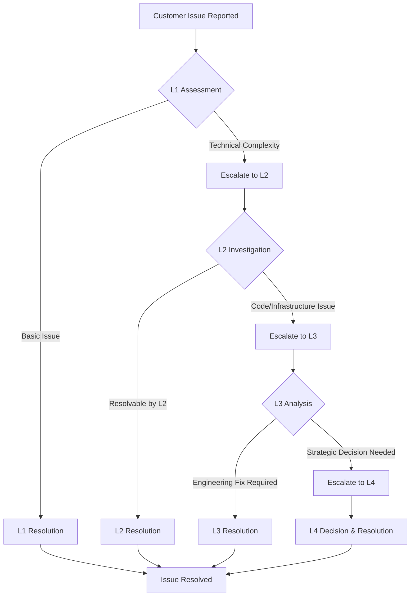

# Escalation Procedures

**Document Version:** 1.0
**Effective Date:** 2026-03-18
**Owner:** Support Operations Manager
**Approval:** [To be approved by Clawdia]

## 1. Purpose

This document defines the escalation procedures for customer support issues, technical problems, and operational incidents. The goal is to ensure timely resolution of issues while maintaining clear communication and accountability.

## 2. Scope

These procedures apply to:
- All customer support agents
- Technical support team members
- Engineering and development teams
- Management and executive staff
- External partners and vendors (as applicable)

## 3. Definitions

### 3.1 Escalation Levels

**Level 1 (L1) - Frontline Support**
- Initial point of contact for customers
- Handles basic issues and routine inquiries
- Escalates to L2 for technical complexity

**Level 2 (L2) - Technical Support**
- Technical experts with deeper product knowledge
- Handles complex technical issues and bug investigation
- Escalates to L3 for code-level or infrastructure issues

**Level 3 (L3) - Engineering/Development**
- Software engineers and system administrators
- Handles code defects, infrastructure problems, security issues
- Escalates to L4 for strategic decisions or major incidents

**Level 4 (L4) - Management/Executive**
- Department heads and executive leadership
- Handles strategic decisions, major incidents, customer escalations
- Final decision-making authority

### 3.2 Escalation Triggers

**Time-based Triggers:**
- Issue unresolved after [X] hours at current level
- SLA violation imminent or occurred
- Customer waiting beyond acceptable timeframe

**Impact-based Triggers:**
- Affecting [Y] number of users
- Impacting [Z] amount of revenue
- Causing service degradation or outage
- Security or compliance risk identified

**Complexity-based Triggers:**
- Requires specialized expertise not available at current level
- Involves multiple systems or integrations
- Requires code changes or infrastructure modifications

**Customer-based Triggers:**
- VIP or strategic customer issue
- Executive customer escalation
- Legal or compliance concern raised
- Customer dissatisfaction expressed

## 4. Escalation Workflows

### 4.1 Technical Issue Escalation Workflow



#### Step-by-Step Process:

**Step 1: L1 Assessment (0-15 minutes)**
1. Receive and acknowledge customer issue
2. Perform initial triage and categorization
3. Attempt basic troubleshooting
4. If resolvable at L1: proceed to resolution
5. If requires escalation: document reason and escalate to L2

**Step 2: L2 Investigation (15 minutes - 2 hours)**
1. Review escalation documentation
2. Perform detailed technical investigation
3. Attempt advanced troubleshooting
4. If resolvable at L2: implement solution
5. If requires engineering: escalate to L3 with complete documentation

**Step 3: L3 Analysis (2-8 hours)**
1. Review technical documentation
2. Analyze root cause
3. Develop fix or workaround
4. If engineering fix required: implement and test
5. If strategic decision needed: escalate to L4 with recommendations

**Step 4: L4 Decision (As needed)**
1. Review situation and impact
2. Make strategic decisions
3. Allocate resources if needed
4. Approve major changes or compensations
5. Provide executive communication if required

### 4.2 Customer Complaint Resolution Process

#### Stage 1: Immediate Response (0-15 minutes)
**Actions:**
1. Acknowledge complaint receipt
2. Express empathy and understanding
3. Assure investigation
4. Provide initial timeline

**Communication Template:**
```
Subject: We're investigating your concern - Ticket #[Number]

Dear [Customer Name],

Thank you for bringing this to our attention. We take your concern seriously and have assigned it to our team for immediate investigation.

We will provide an update within [timeframe]. In the meantime, if you have any additional information, please reply to this email.

Sincerely,
[Agent Name]
Support Team
```

#### Stage 2: Investigation & Analysis (1-4 hours)
**Actions:**
1. Gather all relevant information
2. Interview involved parties
3. Analyze root cause
4. Develop resolution options

**Documentation Requirements:**
- Complete incident timeline
- Root cause analysis
- Impact assessment
- Resolution options with pros/cons

#### Stage 3: Resolution & Compensation (4-24 hours)
**Actions:**
1. Present solution to customer
2. Implement agreed resolution
3. Offer appropriate compensation
4. Document agreement

**Compensation Guidelines:**
- **Minor inconvenience:** Apology and explanation
- **Moderate impact:** Service credit (1-7 days)
- **Significant impact:** Refund or extended credit
- **Major impact:** Custom compensation (requires L4 approval)

#### Stage 4: Follow-up & Prevention (1-7 days)
**Actions:**
1. Follow up to ensure satisfaction
2. Implement preventive measures
3. Update processes/training
4. Close with lessons learned

### 4.3 Emergency Escalation Protocol

#### When to Use Emergency Protocol:
- SEV-1 or SEV-2 incidents
- Security breaches or data leaks
- Legal or compliance emergencies
- Executive customer escalations

#### Emergency Contact Sequence:
1. **Primary Contact:** Phone call (if no answer within 5 minutes)
2. **Secondary Contact:** SMS/WhatsApp
3. **Tertiary Contact:** Email with "URGENT" in subject
4. **All Channels:** Simultaneous notification if critical

#### Emergency Response Team:
- **Technical Lead:** [Name] - [Phone] - [Email]
- **Support Manager:** [Name] - [Phone] - [Email]
- **Security Lead:** [Name] - [Phone] - [Email]
- **Executive Sponsor:** [Name] - [Phone] - [Email]

## 5. Communication Protocols

### 5.1 Internal Escalation Communication

#### Escalation Request Template:
```
TO: [Next Level Team/Individual]
CC: [Current Team Lead, Support Manager]
SUBJECT: Escalation Request: [Brief Description] - Ticket #[Number]

ESCALATION DETAILS:
- Ticket Number: #[Number]
- Customer: [Customer Name/ID]
- Issue Summary: [Brief description]
- Current Level: [L1/L2/L3]
- Requested Level: [L2/L3/L4]
- Reason for Escalation: [Detailed explanation]
- Time in Current Level: [X hours/minutes]
- Impact Assessment: [Users affected, revenue impact, etc.]
- Investigation So Far: [Summary of work done]
- Documentation: [Links to relevant documents]
- Suggested Next Steps: [If any]

URGENCY: [Low/Medium/High/Critical]
REQUESTED RESPONSE TIME: [Timeframe]
```

#### Escalation Acceptance Template:
```
TO: [Escalating Team/Individual]
CC: [Team Leads, Support Manager]
SUBJECT: ACCEPTED: Escalation Request - Ticket #[Number]

ESCALATION ACCEPTED:
- Accepted By: [Name/Role]
- Acceptance Time: [Timestamp]
- Estimated Investigation Time: [Timeframe]
- Next Update Expected: [Time]
- Primary Contact: [Name/Contact]
- Backup Contact: [Name/Contact]

ACKNOWLEDGMENT:
[Brief acknowledgment and initial thoughts]

ACTION ITEMS:
1. [First action item]
2. [Second action item]
```

### 5.2 Customer Communication During Escalation

#### Initial Escalation Notification:
```
Subject: Update on Your Ticket #[Number]

Dear [Customer Name],

We wanted to let you know that we're escalating your issue to our [Technical/Engineering/Management] team for further investigation.

Why we're escalating: [Brief, customer-friendly explanation]
What happens next: [Next steps and timeline]
When you'll hear from us: [Next update time]

We appreciate your patience as we work to resolve this for you.

Best regards,
[Agent Name]
Support Team
```

#### Regular Update Template:
```
Subject: Update #[X]: Your Ticket #[Number]

Dear [Customer Name],

Here's an update on your issue:

Current Status: [Status update]
What We're Doing: [Current investigation/fix efforts]
Next Steps: [Planned actions]
Next Update: [When they'll hear from us next]

[If workaround available:]
Workaround: [Description of temporary solution]

Thank you for your continued patience.

Best regards,
[Team Name]
```

## 6. Documentation Requirements

### 6.1 Mandatory Documentation for Escalations

**For All Escalations:**
- [ ] Complete ticket history
- [ ] Customer communication log
- [ ] Problem description and symptoms
- [ ] Steps attempted and results
- [ ] Error messages and logs (if applicable)
- [ ] Impact assessment

**For Technical Escalations (L1→L2→L3):**
- [ ] System configuration details
- [ ] Reproduction steps
- [ ] Log files and error details
- [ ] Screenshots or screen recordings
- [ ] Environment information
- [ ] Previous similar issues (if any)

**For Management Escalations (L3→L4):**
- [ ] Business impact analysis
- [ ] Cost/benefit analysis of solutions
- [ ] Risk assessment
- [ ] Resource requirements
- [ ] Timeline estimates
- [ ] Communication plan

### 6.2 Escalation Log Template

```
ESCALATION LOG - Ticket #[Number]

BASIC INFORMATION:
- Ticket Number: #[Number]
- Customer: [Name/ID]
- Issue Type: [Technical/Billing/Feature/etc.]
- Initial Report Time: [Timestamp]
- Escalating Agent: [Name]

ESCALATION HISTORY:
| Time | From Level | To Level | Reason | Agent |
|------|------------|----------|--------|-------|
| [Time] | L1 | L2 | [Reason] | [Agent] |
| [Time] | L2 | L3 | [Reason] | [Agent] |

CURRENT STATUS:
- Current Level: [Level]
- Current Owner: [Name]
- Status: [Investigating/In Progress/Resolved]
- Last Update: [Timestamp]

IMPACT ASSESSMENT:
- Users Affected: [Number/Range]
- Revenue Impact: [Estimate]
- Service Impact: [Description]
- Reputation Risk: [Low/Medium/High]

RESOLUTION:
- Root Cause: [If identified]
- Solution: [If implemented]
- Resolution Time: [If resolved]
- Customer Satisfaction: [If available]

LESSONS LEARNED:
- [Key learnings]
- [Process improvements needed]
- [Training gaps identified]
```

## 7. Performance Metrics & SLAs

### 7.1 Escalation Performance Targets

**Response Time SLAs:**
- **L1 to L2 Escalation:** < 30 minutes
- **L2 to L3 Escalation:** < 2 hours
- **L3 to L4 Escalation:** < 4 hours
- **Emergency Escalation:** < 15 minutes

**Resolution Time Targets:**
- **L2 Issues:** < 8 hours from escalation
- **L3 Issues:** < 24 hours from escalation
- **L4 Issues:** < 48 hours from escalation
- **Emergency Issues:** < 4 hours from escalation

**Quality Metrics:**
- **Escalation Accuracy Rate:** > 90% (appropriate escalations)
- **Documentation Completeness:** > 95%
- **Customer Satisfaction Post-Escalation:** > 4.0/5.0
- **Re-escalation Rate:** < 10%

### 7.2 Monitoring & Reporting

**Daily Monitoring:**
- Number of escalations by level
- Average time at each level
- SLA compliance rates
- Top escalation reasons

**Weekly Reporting:**
- Escalation trends and patterns
- Root cause analysis of frequent escalations
- Team performance metrics
- Improvement opportunities

**Monthly Review:**
- Comprehensive escalation analysis
- Process effectiveness assessment
- Training needs identification
- Strategic improvement planning

## 8. Training & Competency Requirements

### 8.1 Level-Specific Training

**L1 Agents Must Complete:**
- Basic product training
- Customer service skills
- Initial troubleshooting
- Escalation criteria recognition
- Documentation standards

**L2 Agents Must Complete:**
- Advanced technical training
- Debugging and log analysis
- System architecture understanding
- Intermediate escalation management
- Cross-functional communication

**L3 Engineers Must Complete:**
- Codebase familiarity
- Infrastructure knowledge
- Security protocols
- Advanced escalation handling
- Business impact assessment

**L4 Managers Must Complete:**
- Strategic decision-making
- Resource allocation
- Executive communication
- Risk management
- Customer relationship management

### 8.2 Certification Requirements

- **L1 Certification:** Required before handling customer issues independently
- **L2 Certification:** Required before handling technical escalations
- **L3 Certification:** Required before handling engineering escalations
- **L4 Designation:** Assigned based on role and experience

## 9. Continuous Improvement

### 9.1 Improvement Process

**Monthly Escalation Review:**
1. Analyze escalation patterns and trends
2. Identify root causes of frequent escalations
3. Assess process effectiveness
4. Develop improvement actions
5. Implement and monitor changes

**Quarterly Process Audit:**
1. Comprehensive process review
2. Benchmark against industry standards
3. Technology and tool assessment
4. Training program evaluation
5. Strategic improvement planning

### 9.2 Feedback Mechanisms

**Agent Feedback:**
- Monthly escalation process feedback sessions
- Suggestion system for process improvements
- Post-escalation debrief sessions

**Customer Feedback:**
- Post-escalation satisfaction surveys
- Customer advisory board input
- Social media and review monitoring

**Cross-functional Feedback:**
- Regular meetings with engineering/development
- Product team collaboration sessions
- Executive feedback and guidance

## 10. Appendices

### Appendix A: Emergency Contact List

[To be populated with actual contact information]

### Appendix B: Escalation Decision Tree

[Visual decision tree for common escalation scenarios]

### Appendix C: Template Library

- Escalation request templates
- Customer communication templates
- Documentation templates
- Reporting templates

### Appendix D: Glossary of Terms

- **SLA:** Service Level Agreement
- **SEV:** Severity Level
- **L1/L2/L3/L4:** Escalation levels
- **MTTR:** Mean Time to Resolution
- **MTTA:** Mean Time to Acknowledge

---

**Document Control:**

| Version | Date | Author | Changes | Approval |
|---------|------|--------|---------|----------|
| 1.0 | 2026-03-18 | Shuri | Initial creation | Pending |
| | | | | |

**Review Schedule:** Quarterly
**Next Review Date:** 2026-06-18
**Distribution:** All support staff, technical teams, management